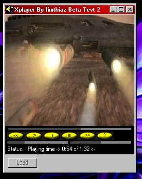



## Player\.Ocx II \*\*\* Update \*\*\*\*

### Description

This is update notification Please Visit

And don't forget to vote me.....

Please Try The The Ocx. Supports More than 10 formats Including Mp3. Multi-Threading. You can play nearly 10 to 20 files of music at the same time. Provided your system is good. Now FullScreen Mode(Small Bug). Change Video Size. Change Volume And Left Right Channel Sound Volumes Still More to Come. You can icq me at 24294947 or mail me at imthiazrafiq@hotmail.com for further details...................please Vote For Me..... Please vote Me..... Please vote Me.... Please vote Me... Please vote Me.. Please vote Me.
 
### More Info
 

             |
---                |---
**Submitted On**   |2000-09-29 02:15:28
**By**             |[Imthiaz Rafiq](https://github.com/Planet-Source-Code/PSCIndex/blob/master/ByAuthor/imthiaz-rafiq.md)
**Level**          |Beginner
**User Rating**    |2.8 (28 globes from 10 users)
**Compatibility**  |VB 6\.0
**Category**       |[Sound/MP3](https://github.com/Planet-Source-Code/PSCIndex/blob/master/ByCategory/sound-mp3__1-45.md)
**World**          |[Visual Basic](https://github.com/Planet-Source-Code/PSCIndex/blob/master/ByWorld/visual-basic.md)
**Archive File**   |[CODE\_UPLOAD102509282000\.zip](https://github.com/Planet-Source-Code/imthiaz-rafiq-player-ocx-ii-update__1-11740/archive/master.zip)

### API Declarations

Please Vote me Please Vote me Please Vote me Please Vote me Please Vote me Please Vote me Please Vote me Please Vote me Please Vote me Please Vote me Please Vote me Please Vote me Please Vote me Please Vote me Please Vote me

